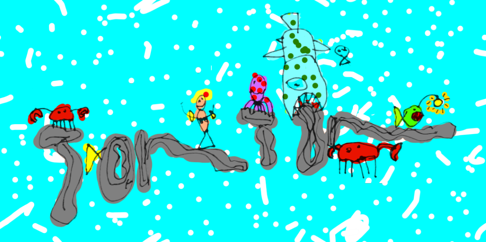

<h1>{{ page.heading }}</h1>

{{ page.intro }}

<svg id="t1" xmlns="http://www.w3.org/2000/svg" width="550" height="150" viewBox="0 0 275 75">
  <path fill="none" stroke="#000" d="M22.5 8c-1.8 3-1.4 23.7-5.8 32.4-4.3 8.6-2 21.3-5.4 26.3"/>
  <path fill="none" stroke="#000" d="M2.6 8C14 10 21.3 5.3 36 6.8 51 8.3 55-4 56 4"/>
  <path fill="none" stroke="#000" d="M52 29c-10.8 5.5-18.6 19.2-15 29.7 2.4 7 13.8 13.3 20 9.4 10.7-6.3 10.8-31 0-38-2-1-6.4 1-6 3.7.7 5 10 2 15 2.7 3.8.6 9-1.7 11.7 1 6 5.6 1.8 14 3.2 24.4 2-8.5.4-25 10-25.4 8-.4 6 21.7 10 22.2 2 .2 2.7-14.8 8.4-15.2 6.7-.4 9 17.8 12.2 16"/>
  <path fill="none" stroke="#000" d="M167.3 10c-11.8 5.5-17.6 44.2-19.5 55.4"/>
  <path fill="none" stroke="#000" d="M140 19.8c5-7 20.4-15 28-10.2-4 7.3 12.7 2.8 17 3.5"/>
  <path fill="none" stroke="#000" d="M189 32.8c-13.3 2.8-26.8 28-16.7 37 6.7 6 20.3-5.3 23-13.8 2.5-7.2-1.2-22.5-8.6-21-1.8.5-8.2 6 .2 5.7 8-.2 17-10 21-1.5 2 4.2 3 23 7.3 34-.3-10-6.3-26.2-.3-37.5 11.3-2.6 9.8 25 20 29.8 5.4-7 2.8-26 11.7-27.2 6.7-.8 11 18.7 15.6 27.3 3 5.7 4.4 8.2 6.5 4.4"/>
</svg>

<button id="rerun">Re-run</button>

Find us on <a href="https://www.facebook.com/Seaweedsandwich">Facebook</a> and <a href="https://www.twitter.com">Twitter</a>

